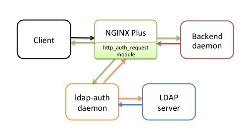

# Another LDAP authentication

&#9888; This version of ___Another LDAP Auth___ is forked from <https://github.com/dignajar/another-ldap-auth> &#9888;

__LDAP Authentication__ for __Nginx__, __Nginx ingress controller__ (Kubernetes), __HAProxy__ ([haproxy-auth-request](https://github.com/TimWolla/haproxy-auth-request)) or any webserver/reverse proxy with authorization based on the result of a subrequest.

__Another LDAP Authentication__ is an implementation of the `ldap-auth-daemon` services described in the official blog from Nginx in the [following article](https://www.nginx.com/blog/nginx-plus-authenticate-users/).

__Another LDAP Authentication__ is prepared to run inside a Docker container, also you can run the Python script without the Docker container.

[](https://hub.docker.com/r/jgkirschbaum/another-ldap-auth)
[](https://github.com/jgkirschbaum/another-ldap-auth/tree/gh-pages)
[](https://github.com/jgkirschbaum/another-ldap-auth/tree/main/kubernetes)
[](https://codebeat.co/projects/github-com-jgkirschbaum-another-ldap-auth-main)
[](https://github.com/jgkirschbaum/another-ldap-auth/releases)
[](https://github.com/jgkirschbaum/another-ldap-auth/blob/main/LICENSE)

## Features

- Supports `ldap` and `ldaps`.
- Provide a cache for users and groups, you can set the cache expiration in minutes.
- Supports validation by groups, regex in groups are supported.
- Supports TLS.
- Supports ad-hoc TLS via self-signed certificate.
- Supports configuration via headers or via environment variables.
- Supports HTTP response headers such as username and matched groups.
- Adds Gunicorn WSGI HTTP server for production environments.
- Brute force protection.
- Log format in Plain-Text or JSON.

## Diagram



## Available configurations parameters

The parameters can be sent via environment variables or via HTTP headers, also you can combine them.

The parameter `LDAP_SEARCH_FILTER` support variable expansion with the username, you can do something like this `(sAMAccountName={username})` and `{username}` is going to be replaced by the username typed in the login form.

The parameter `LDAP_BIND_DN` support variable expansion with the username, you can do something like this `{username}@example.org` or `UID={username},OU=PEOPLE,DC=example,DC=org` and `{username}` is going to be replaced by the username typed in the login form.

All values type are `string`.

### Environment variables

| Key | Default | Values | Description | Example |
| --- | ------- | ------ | ----------- | ------- |
| USE_WSGI_SERVER | `true`| `true`, `false` | Enables or disables the [Gunicorn](https://gunicorn.org/) WSGI Server. | |
| NUMBER_OF_WORKERS __(Optional)__ | `1` | _`<int>`_ | Number of workers for the Gunicorn WSGI HTTP server. Should be one because of better cache performance as every worker has its own cache.  | 2 |
| TLS_ENABLED | `true`| `true`, `false` | Enable or disable HTTPS support. When used without WSGI server the certificates are self signed and created automatically | |
| TLS_KEY_FILE | `path_to_file`| | Path to the TLS key file in PEM format. | `/home/aldap/tls/server.key` |
| TLS_CERT_FILE | `path_to_file`| | Path to the TLS certificate file in PEM format. | `/home/aldap/tls/server.crt` |
| TLS_CA_CERT_FILE | `path_to_file`| | Path to the TLS CA certificates file in PEM format. | `/home/aldap/tls/ca.crt` |
| LDAP_ENDPOINT | | | LDAP URL with the protocol and the port number. | `ldaps://ldapsever.example.org:636` |
| LDAP_MANAGER_DN_USERNAME | | | Username to bind and search in the LDAP tree. | `CN=john,OU=administrators,DC=example,DC=org`               |
| LDAP_MANAGER_PASSWORD | | | Password for the bind user. | `top_secret` |
| LDAP_SEARCH_BASE | | | Base in directory tree where the search starts. | `DC=example,DC=org` |
| LDAP_SEARCH_FILTER | | | Filter for search, for Microsoft Active Directory usually you can use `sAMAccountName`. | `(sAMAccountName={username})` |
| LDAP_BIND_DN | `{username}` | | Depends on your LDAP server the binding structure can change. This field supports variable expansion for the username. | `{username}@example.org` or `UID={username},OU=people,DC=example,DC=org` |
| LDAP_ALLOWED_USERS __(Optional)__ | | | Support a list separated by commas.| `'john,jack,jeff'` |
| LDAP_ALLOWED_GROUPS __(Optional)__ | | | Supports regular expressions, and support a list separated by commas.| `'DevOps production environment', 'Developers .* environment'` |
| LDAP_ALLOWED_GROUPS_CONDITIONAL | `and` | `and`, `or` | Conditional to match all the groups in the list or just one of them. | `or` |
| LDAP_ALLOWED_GROUPS_CASE_SENSITIVE | `enabled` | `enabled`, `disabled` | Enabled or disabled case sensitive groups matches. | `disabled` |
| LDAP_ALLOWED_GROUPS_USERS_CONDITIONAL | `or` | `and`, `or` | Conditional to match user and at least one group in the list, or one of the two | `and` |
| CACHE_EXPIRATION | `5` | | Cache expiration time in minutes. | `10` |
| LOG_LEVEL | `INFO` | `INFO`, `WARNING`, `ERROR`, `DEBUG` | Logger level. | `DEBUG` |
| LOG_FORMAT | `TEXT` | `TEXT`, `JSON` | Output format of the logger. | `JSON` |
| BRUTE_FORCE_PROTECTION | `disabled`| `enabled`, `disabled` | Enabled or disabled Brute force protection per IP. | |
| BRUTE_FORCE_EXPIRATION | `10`| | Brute force expiration time in seconds per IP. | |
| BRUTE_FORCE_FAILURES | `3`| | Number of failures before the IP is blocked.  | |

### HTTP request headers

The variables send via HTTP headers take precedence over environment variables.

- `Ldap-Endpoint`
- `Ldap-Manager-Dn-Username`
- `Ldap-Manager-Password`
- `Ldap-Bind-DN`
- `Ldap-Search-Base`
- `Ldap-Search-Filter`
- `Ldap-Allowed-Users`
- `Ldap-Allowed-Groups`
- `Ldap-Allowed-Groups-Case-Sensitive`
- `Ldap-Allowed-Groups-Conditional`

### HTTP response headers

- `x-username` Contains the authenticated username
- `x-groups` Contains the username matches groups

## Method 1 - Installation and configuration with Docker

The easy way to use __Another LDAP Authentication__ is running as a Docker container and set the parameters via environment variables.

### Step 1 - Run as a Docker container

Change the environment variables with your setup.

```bash
docker run -d \
    -e USE_WSGI_SERVER='false' \
    -e TLS_ENABLED='false' \
    -e LDAP_ENDPOINT='ldaps://example.org:636' \
    -e LDAP_MANAGER_DN_USERNAME='CN=john-service-user,OU=Administrators,DC=example,DC=org' \
    -e LDAP_MANAGER_PASSWORD='MasterpasswordNoHack123' \
    -e LDAP_BIND_DN='{username}@example.org' \
    -e LDAP_SEARCH_BASE='DC=example,DC=org' \
    -e LDAP_SEARCH_FILTER='(sAMAccountName={username})' \
    -e LOG_FORMAT='JSON' \
    -p 9000:9000 \
    --name another_ldap_auth \
    jgkirschbaum/another-ldap-auth:latest
```

__Another LDAP Authentication__ is now running on `http://localhost:9000/`.

Test it via curl:

```bash
curl -v -u myuser:mypassword http://localhost:9000/
```

Output from ALDAP:

```text
{"date": "2021-05-21 10:06:52", "level": "INFO", "objectName": "Cache", "ip": "192.168.0.10", "referrer": null, "message": "User not found in the cache.", "username": "myuser"}
{"date": "2021-05-21 10:06:52", "level": "INFO", "objectName": "Aldap", "ip": "192.168.0.10", "referrer": null, "message": "Authenticating user.", "username": "myuser", "finalUsername": "myuser"}
{"date": "2021-05-21 10:06:53", "level": "INFO", "objectName": "Aldap", "ip": "192.168.0.10", "referrer": null, "message": "Authentication successful.", "username": "myuser", "elapsedTime": "0.22335"}
{"date": "2021-05-21 10:06:53", "level": "INFO", "objectName": "Cache", "ip": "192.168.0.10", "referrer": null, "message": "Adding user to the cache.", "username": "myuser"}
192.168.0.10 - - [21/May/2021 10:06:53] "GET / HTTP/1.1" 200 -
```

> Remember you can enable self-signed certificate from Flask via the environment variable `TLS_ENABLED=="true"` but only if `USE_WSGI_SERVER=="false"`.

### Step 2 - Nginx configuration

Nginx uses the module [ngx_http_auth_request_module](http://nginx.org/en/docs/http/ngx_http_auth_request_module.html) to do the subrequest.

The following example shows how to configure Nginx that is running on the same machine as __Another LDAP Authentication__. The backend `/private/` includes the authentication request to `/another_ldap_auth`.

```nginx
location /private/ {
    auth_request /another_ldap_auth;
    # ...
    # Here you private site
}

location = /another_ldap_auth {
    internal;
    proxy_pass_request_body off;
    proxy_set_header Content-Length "";
    proxy_pass http://localhost:9000;
}
```

Now you can access to your website wich is going to be something like this `http://myserver.com/private/` and Nginx will request you to write the username and password.

## Method 2 - Installation and configuration with YAML files

### Step 1 - Deploy to Kubernetes with YAML

Get the K8s manifests from the folder `/kubernetes`.

The manifests for K8s help to deploy __Another LDAP Authentication__ in the namespace `ingress-nginx` and expose the service in the cluster at the following address `http://another-ldap-auth.ingress-nginx:9000/`.

Please change the environment variables from the manifest and the secret for the password of the bind username.

### Step 2 - Annotate your Nginx ingress controller

After you have running __Another LDAP Authentication__ in your Kubernetes cluster, you can modify the ingress manifest from the application you want to protect.

You can remove the comment `#` and send headers as variables such as `Matching groups`.

```yaml
---
apiVersion: extensions/v1beta1
kind: Ingress
metadata:
  name: demo-webserver
  namespace: demo
  annotations:
    nginx.ingress.kubernetes.io/auth-url: http://another-ldap-auth.ingress-nginx:9000

    # nginx.ingress.kubernetes.io/auth-snippet: |
    #   proxy_set_header Ldap-Allowed-Groups "<SOME GROUP>";
    #   proxy_set_header Ldap-Allowed-Groups-Conditional "or";
spec:
  rules:
  - host: demo.local
    http:
      paths:
      - path: /
        backend:
          serviceName: demo-webserver
          servicePort: 80
```

## Method 3 - Installation and configuration with the Helm chart

### Step 1 - Deploy to Kubernetes with Helm

Deploy __Another LDAP Authentication__ with the method described under <https://github.com/jgkirschbaum/another-ldap-auth/tree/gh-pages>. All configuration is documented under <https://github.com/jgkirschbaum/another-ldap-auth/tree/main/charts/another-ldap-auth>.

### Step 2

See Method 2 - Step 2.

## Brute Force protection

Brute force protection is blocking user IP, please read this article to know the limitations about blocking IPs

- <https://owasp.org/www-community/controls/Blocking_Brute_Force_Attacks>

## Known limitations

- Parameters via headers need to be escaped, for example, you can not send parameters such as `$1` or `$test` because Nginx is applying variable expansion.
